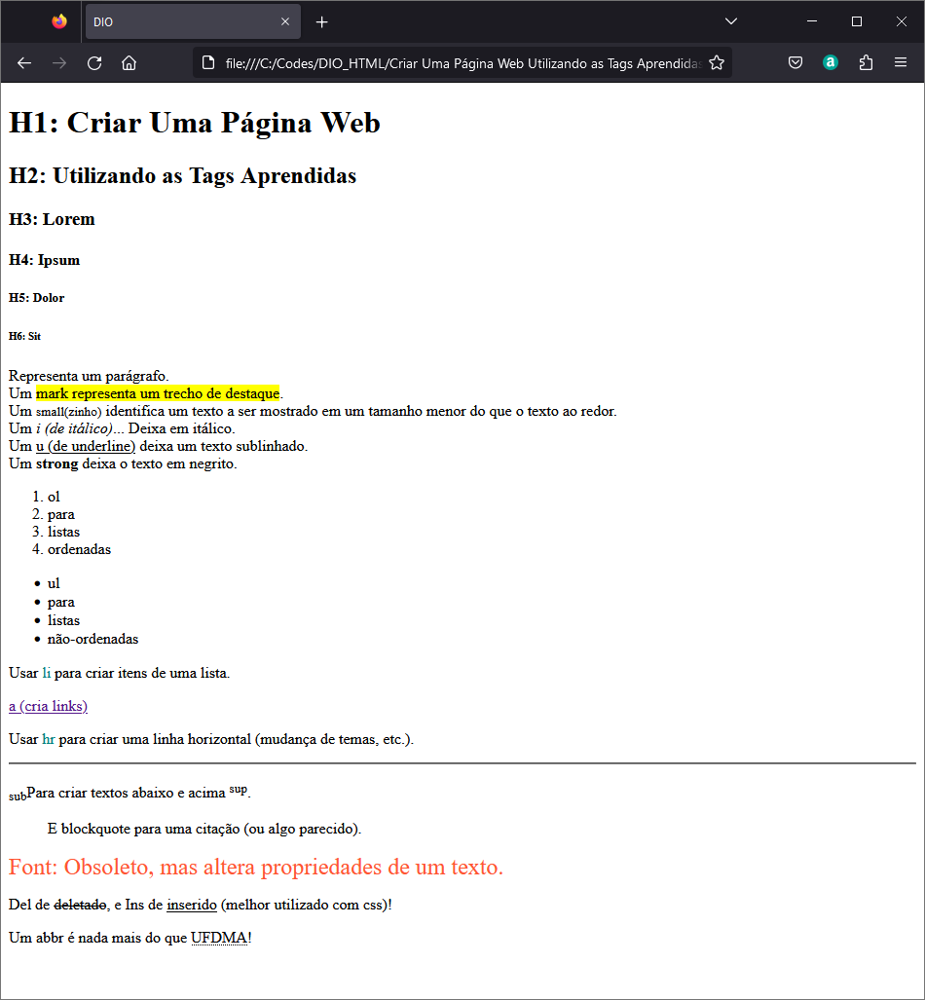

# Criar Uma Página Web Utilizando as Tags Aprendidas

Utilizar todas as tags explicadas nas aulas: `<h1>` até `<h6>`, `
`, `<mark>`, `<small>`, `<i>`, `<u>`, `<strong>`, `<ol>`, `<ul>`, `<li>`, `<a>`, `
`, ``, ``, `<blockquote>`;

Utilizar novas tags sugeridas: ``, `<del>`, `
`, `<abbr>`.

